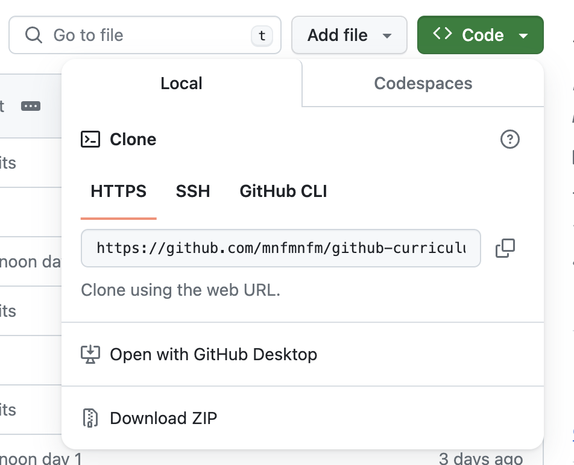
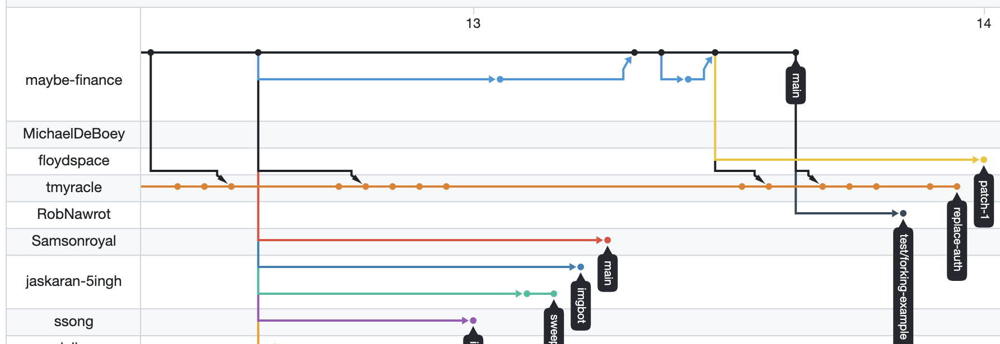

# Day 2 Morning Session

## Agenda

- Multiplayer GitHub
    - Adding collaborators
    - Cloning repos
- Branches
    - What
    - How
    - Lab
- Code Review
    - Best practices
- Merge Conflicts
    - How they happen
    - Resolving them
    - Lab: resolving merge conflicts
- Any extra time: project time

## Working on Teams

There are two main ways to work with other people on GitHub. For larger projects, or especially if you are working with the same people on many different projects or repos, GitHub organizations provide a useful way of organizing people and code. Or, for smaller projects, you can directly add collaborators to a repo.

### Adding Collaborators Directly to Repos

Adding collaborators directly to a repo is the lightest-weight, easiest way to work with other people on a one-off coding project.

To add collaborators to a repo, visit the "settings" page for your repo, choose "collaborators" on the left, and enter the email addresses or GitHub usernames of the people you would like to collaborate with. Note that the people you invite will need to check their emails and accept the invitation to be able to collaborate on that repo.

### Cloning Code

When we create a new repo, we do that with `git init` and then connect the repo with one on GitHub. But when working on a team, you only need to create a single repo, and you'll use `git clone` to copy that repo onto multiple computers.

Once someone on your team has created a repo for your team to work in, the rest of your team should clone the repo onto your own computers. To do this, on the GitHub repo's website, click on the green "Code" button, and copy the URL that appears under the "Local" tab.



Take that URL to the command line. `cd` to wherever you want that code to live on your computer, and run:

```bash
git clone https://TheGitHubUrlThatYouCopiedGoesHere
```

Now, you have a fully-featured version of that code on your computer, in the same 

## Branches and Pull Requests

Branches on git allow you to create multiple different timelines with commits. A new branch acts as a parallel universe - you can have new commits on that branch that are different from an existing branch. This is commonly used on development teams so that each person can do their work on a separate branch, and once you complete each task, you then merge that branch in with your `main` branch to get those changes back onto the main branch.

These get visualized often in diagrams that look like this example, taken from [the Maybe Finance repo](https://github.com/maybe-finance/maybe). In this diagram, each horizontal line represents a single branch, and each dot represents a commit on that branch. In particular, near the top of the image, you can see the blue line, a new feature branch, where some work gets done, a new commit is made, and then that commit is merged back in to the main branch. This happens twice. The other horizontal lines represent feature branches with ongoing work.



Your general workflow will be to create a new branch for each feature you wish to build. You'll work on that branch until you've finished the feature you want to build, then you'll create a *pull request* on GitHub to merge that feature branch back into your main branch. On a team, your teammates will then look at that pull request to review your code and make sure it looks good; then, assuming all has gone well, you will merge that branch into your GitHub repo, and pull those changes onto your local main branch.

The git commands you will use to implement this workflow:

```bash
git checkout -b featurebranchname # check out a new feature branch
# write your code
git add . # add your code files to be committed
git commit -m "description of commit"
# repeat add/commit while you continue writing code. when you have finished adding/committing all your code:
git push -u origin featurebranchname
# go to GitHub and create pull request
# review your own code
# merge pull request on GitHub
# now, to get the GitHub code back onto your machine:
git checkout main # switch back to main branch
git pull # pulls the merged code from GitHub onto your computer
# now you are ready to start from the top by creating a new feature branch!
```

## Lab: Practice Git with Branching

1. Identify a change that you want to make to your existing git repo. (For the first one, do something easy, like adding comments or updating your README file, so you can practice with the workflow).
2. Using the workflow steps above, check out a feature branch and make that change.
3. Repeat to continue practicing with git branching.

## Code Review

A common practice in software engineering is code review. After an engineer finishes writing code, before they merge it into their main branch or otherwise make that code available to everyone, they get a review of that code from other people on the team. Code review has a few important purposes:

* Ensures code does what it says it does
* Provides a safeguard against malicious code (say, code that puts a vulnerability in the project)
* Allows engineers to learn from each others' coding practices

There are lots of things that engineers might notice in a code review and ask for revisions:

* Style issues: indentation or capitalization issues
* Naming issues: unclear or misleading function or variable names
* Comments: out-of-date, misleading, or missing comments
* Small coding issues: a small inefficiency
* Larger coding issues
* A complete rewrite of the entire project

I have personally seen code reviews with all of these outcomes.

## Merge Conflicts

One issue that arises once you have multiple people working on the same piece of code is merge conflicts. This happens when multiple branches have edits to the same part of the same file. When you attempt to merge those branches together, git doesn't know which version of the file to use as the most up-to-date version, so it needs you to manually step in and show it what the merged version of the code should look like.

## Avoiding Merge Conflicts

There are three main parts to avoiding merge conflicts. One is the obvious solution: try not to have two different people working on the same chunk of code at the same time. Even if you are working in the same file as someone else, as long as you are not touching the same lines of code, you won't cause a merge conflict.

Secondly, each time that a team member merges a change into the main branch, it is the responsibility of *all other team members* to merge that new change into their feature branch. On teams I've worked on in the past, we've done this by having each person on the team yell (or message) "PULL!", at which point everyone pulls the code into their branch by following these steps:

```bash
# you are working on a feature branch, and then someone yells "pull!"
# get to a stopping point in your code, add and commit
git status # make sure you know which branch you're working on
git checkout main # switch to the main branch
git pull # pulls the new code from GitHub's main branch to your computer's main branch
git checkout yourfeaturebranch # switch back to your own branch
git merge main -m "merge" # merge the main branch into your own branch
```
Running that `merge` command is when you might discover a merge conflict; as git tries to combine both versions of the code, that's when it might notice that the new code touches some of the same lines of code that you have already edited. When that happens, you'll need to resolve that merge conflict on your machine before you continue.

## Resolving Merge Conflicts

When a merge conflict happens, don't panic! They are a natural part of a git development lifecycle, and they're resolvable. My best advice: Run `git status` often during a merge conflict, because it will tell you exactly what you need to run next to get out of the merge conflict.

When you have a merge conflict, the first step is to open your text editor and go to the file(s) where the conflict is. You'll find the merge conflict highlighted in VSCode; it'll have less-than and greater-than signs surrounding it, showing the two different versions of the code. Your job is to pick out whether the code SHOULD have one of those versions of code, or both, or something in between, and edit the code to its correct version, including removing the `>>>>` and `<<<<` lines.

## Lab: Creating and Resolving Merge Conflicts

1. Split your team into two halves. Each half will work together.
1. If you have not already done so, create a shared repo among your team members where you will keep your project code, and put a basic README file in that repo. Ensure that the driver-computers have the repo cloned.
1. Simultaneously, on each driver computer, each half should check out a new branch (`git checkout -b newbranchname`), and on that branch, should make an edit to the first paragraph of the README file. Make different changes from each other!
1. Each half should add, commit, and push their changes on their branches.
1. The first half of the team should make a pull request from their branch into the main branch, and merge their new pull request.
1. The second half of the team should now make a pull request. You should notice that GitHub tells you it is "unable to merge" due to a conflict. This is because you did not pull down the code after the first half of the team merged their changes into the main branch.
1. On the second half of the team, use the steps above to check out the main branch, pull the code, and merge it into your feature branch, at which point you will see the merge conflict happening.
1. Resolve the merge conflict by editing the README file to contain the "correct" paragraph. Add and commit it, and push your changes to the same branch you've been working on.
1. Your pull request will automatically update to say that it is mergeable now. Merge the pull request.
1. Check the README file to make sure you haven't accidentally left in any of the merge conflict markers.
1. Switch halves! Let the other half of the team get experience in resolving a pull request.