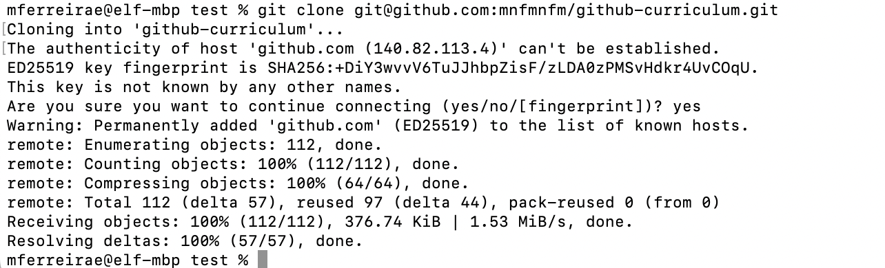

# Prework/Installation

Prior to the course, you have two tools to install, VSCode and git, and a few other prereqs: practicing with the command line, signing up for a GitHub account, and choosing a project that you'll upload to GitHub during our first workshop.

If you have any questions or run into issues with these steps, feel free to email Michelle, michelle at ferreirae dot com, or come early the first day of the program so we can debug it together.

### VSCode installation

Visual Studio Code (VSCode) is a free, modern code editor used by everyone from small companies to tech giants. Install for Windows, Mac or Linux from [their website](https://code.visualstudio.com/). Once you have it installed, open up any past coding project in it, just to get a feel for the interface.

### Command Line Basics

Optional: if you have experience using the command line, you may skip this step!

If you do not have much experience using a terminal or command line, please take 30 minutes or so to try out using the terminal with an introduction from a reputable source like [The Odin Project](https://www.theodinproject.com/lessons/foundations-command-line-basics) or [MDN (a little more web development focused, but also more comprehensive)](https://developer.mozilla.org/en-US/docs/Learn/Tools_and_testing/Understanding_client-side_tools/Command_line). On Mac, you can complete this in the Terminal app; on Windows, you can use Git Bash, installation instructions below, or you can set up the [Windows Subsystem for Linux](https://learn.microsoft.com/en-us/windows/wsl/), which requires more configuration, but is very cool.

### Sign Up for a GitHub Account

If you do not already have one, please sign up for an account on [GitHub's website](https://github.com/). This will allow you to push code from your computer to GitHub. (No preference from me on whether you use your Wellesley email address or a personal one)

### git installation

Git is the command line tool that will allow us to perform version control, which is a key objective of the course. Installation instructions vary per operating system.

#### git for Mac

Open your Terminal application and, at the command prompt, type `git --version`. If you do not already have `git` installed, this will prompt you to install it.

Once the installation has finished, close and re-open your terminal, and type `git --version`. If it has installed correctly, you will see a version number as the output.

You'll also need to install the [Git Credential Manager](https://github.com/git-ecosystem/git-credential-manager/releases/tag/v2.4.1). On newer Macs, download the `gcm-osx-x64-2.4.1.pkg` installer.

#### git for Windows (Streamlined)

Use the Download button on the [Git for Windows homepage](https://gitforwindows.org/) to install both git and Git BASH on your Windows machine. The only default you should change is on the screen for "Adjusting the name of the initial branch in new repositories", choose the option to "Override the default branch name for new repositories". Its suggestion of "main" is correct.


#### git for Windows (Advanced)

If you want to try something more interesting/complicated for Windows installation, you can set up the Windows Subsystem for Linux or WSL, which will give you a fully-featured Linux interface that can access the same files as your Windows OS. Installation instructions are [here](https://learn.microsoft.com/en-us/windows/wsl/install) - if you don't have another preference, Ubuntu is a good "default" Linux distribution.

Then, you can open a WSL/Ubuntu terminal and run the command `sudo apt-get install git` to make sure you have the most recent version of git installed.

You can find more direction on how to use git with WSL on [Microsoft's tutorial page](https://learn.microsoft.com/en-us/windows/wsl/tutorials/wsl-git).

### Configure Git (all operating systems)

To configure git on your machine, open a new Terminal window (Mac) or Git Bash window or WSL command prompt (Windows) and run these commands, substituting your information in the first two.

```bash
git config --global user.name "Your Name"
git config --global user.email "yourGithubAcctEmailAddress@example.com"
git config --global init.defaultBranch main
git config --global color.ui auto
```

### Set Up SSH Keys (all operating systems)

There are a few different ways to authenticate with GitHub, but we're going to use SSH keys, which are a little bit annoying to set up, but then work extremely well forever. Once you've installed and configured git locally, you can use GitHub's instructions to set up SSH keys on your system. You'll need to follow these steps. **Note** that each step has an option at the top to toggle among Mac/Windows/Linux operating systems, so pick the right one for you.

* [Generate an SSH key](https://docs.github.com/en/authentication/connecting-to-github-with-ssh/generating-a-new-ssh-key-and-adding-it-to-the-ssh-agent)
    * It's easiest to generate one without a passphrase
* [Add the SSH key to your GitHub account](https://docs.github.com/en/authentication/connecting-to-github-with-ssh/adding-a-new-ssh-key-to-your-github-account)

You can test whether your new SSH key is working correctly by opening a terminal and running the following command, which will download this repo of course material onto your machine.

```bash
git clone git@github.com:mnfmnfm/github-curriculum.git
```

The first time you use the SSH key, you'll probably get a warning that the authenticity of the host can't be established - that's fine, type "yes" at the prompt to continue.

Output that looks like this means your SSH key is working correctly!


### Identify a Prior Project

To practice making git repos, you'll start by taking a past project that you worked on, committing it to a git repo, and pushing it to GitHub. To prepare for this, please ensure that you have some sort of a project on your computer's filesystem on which you have not previously used version control. This can be any coding project, like a previous problem set, or even better, a larger project with multiple files, or a whole series of problem sets from one course. Then, for whatever project you've chosen, make sure you know where to find it on your computer, and make sure it's in a single folder/directory.
