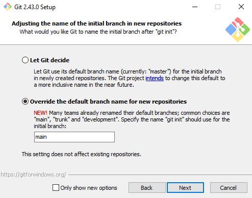

# Prework/Installation

Prior to the course, you have two tools to install, VSCode and git, and a few other prereqs: identifying a project to upload to GitHub on our first day, signing up for a GitHub account, and making sure you have a bit of experience with the command line.

If you have any questions or run into issues with these steps, feel free to email Michelle, michelle at ferreirae dot com, or come early the first day of the program so we can debug it together.

### VSCode

Visual Studio Code (VSCode) is a free, modern code editor used by everyone from small companies to tech giants. Install for Windows, Mac or Linux from [their website](https://code.visualstudio.com/). Once you have it installed, open up any past coding project in it, just to get a feel for the interface.

### Command Line Basics

If you do not have much experience using a terminal or command line, please take 30 minutes or so to try out using the terminal with an introduction from a reputable source like [The Odin Project](https://www.theodinproject.com/lessons/foundations-command-line-basics) or [MDN (a little more web development focused, but also more comprehensive)](https://developer.mozilla.org/en-US/docs/Learn/Tools_and_testing/Understanding_client-side_tools/Command_line). On Mac, you can complete this in the Terminal app; on Windows, you can use Git Bash, installation instructions below, or you can set up the [Windows Subsystem for Linux](https://learn.microsoft.com/en-us/windows/wsl/), which requires more configuration, but is very cool.

### git

Git is the command line tool that will allow us to perform version control, which is a key objective of the course. Installation instructions vary per operating system.

#### git for Mac

Open your Terminal application and, at the command prompt, type `git --version`. If you do not already have `git` installed, this will prompt you to install it.

Once the installation has finished, close and re-open your terminal, and type `git --version`. If it has installed correctly, you will see a version number as the output.

#### git for Windows

Use the Download button on the [Git for Windows homepage](https://gitforwindows.org/) to install both git and Git BASH on your Windows machine. The only default you should change is on the screen for "Adjusting the name of the initial branch in new repositories", choose the option to "Override the default branch name for new repositories". Its suggestion of "main" is correct.

### Identify a Prior Project

To practice making Git repos, we'll start by having you take a past project that you worked on, commit it to a git repo, and push it to GitHub. To prepare for this, please ensure that you have some sort of a project on your computer's filesystem that you have not previously deployed. This can be any coding project, like a previous problem set, or even better, a larger project with multiple files, or a whole series of problem sets from one course. Then, for whatever project you've chosen, make sure you know where to find it on your computer, and make sure it's in a single folder/directory.

### Sign Up for a GitHub Account

If you do not already have one, please sign up for an account on [GitHub's website](https://github.com/). This will allow you to push code from your computer to GitHub.
